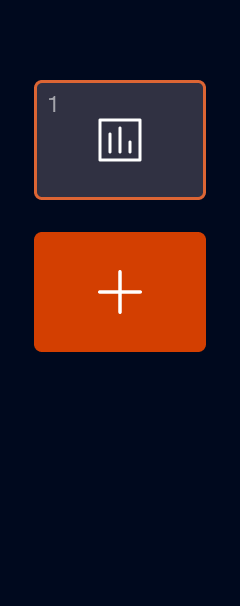

# Dokumentation - Mootimeter Templates und Styling

## SCSS Kompilierung

Für die SCSS Kompilierung in diesem Moodle Plugin wird die Nutzung von [VS Code](https://code.visualstudio.com/) und der Erweiterung [Live Sass Compiler](https://marketplace.visualstudio.com/items?itemName=ritwickdey.live-sass) empfohlen.

Die Erweiterung kann SCSS Dateien erkennen und nach Wünschen kompilieren. Dafür können gewisse Einstellungen vorgenommen werden. Diese werden auf der Plugin Seite genauer beschrieben. Folgend eine Standard Konfiguration, welche mit Mootimeter kompatibel ist:

```php
"liveSassCompile.settings.includeItems": [
        "/**/mootimeter/styles.s[ac]ss",
],
"liveSassCompile.settings.generateMap": false,
"liveSassCompile.settings.partialsList": [
    "/**/mootimeter/scss/**/*.s[ac]ss",
],
```

Hierbei wird nur die Datei styles.scss (oder sass) kompiliert. In dieser werden alle partials eingefügt. Die Einstellung partialsList sorgt dafür, dass der Watcher auf Änderungen reagiert, welche in dem scss-Ordner vorgenommen werden.

## Allgemeines

Folgende Tags werden innerhalb der Klasse .*mootimetercontainer* automatisch durch die Datei fonts.scss gestyled und benötigen keine extra Klasse:

```scss
h1 - h6; p, small
```

TODO:
Die Settings Spalte (*mootimetercoledit*) wird zu Testzwecken über die Klassen *isNotNewPage* und *isNewPage* auf dem Hauptcontainer ein und ausgeblendet. Sollte dies anders gesteuert werden, muss das Styling angepasst werden.

## Wrapper

Die Struktur ist aktuell am besten der Datei /templates/main_screen_new.mustache zu entnehmen. (Nach der Anpassung auch diesen Abschnitt aktualisieren) Die Wrapper Klassen sorgen vor allem für die korrekte mobile Darstellung und den Abstand zwischen den Elementen im entsprechenden Wrapper. Folgend eine grundlegende Auflistung der notwendigen Wrapper Klassen (zum Teil wurden hier für besseren Kontrast die Dark-Mode Varianten genutzt):

### Pages

```scss
.mootimetercolpages

.mootimeter_pages_li
```



### Settings

```html
<div class="mootimetercol mootimetercoledit">

   <div class="mootimetersettings mootimeterfullwidth">

...
```


```html
<p class="text-bold">Antworten</p>
<div class="input-with-checkbox-icon_wrapper">
</div>
```


```html
<p class="text-bold">Visualisierung</p>
<div class="mootimeter-visualization-options-wrapper">
</div>
```


### Content

```html
<div class="mootimetercol mootimetercolcontent">
...
```

```html
<div class="mootimeter-colcontent-preview">
        <div class="mootimeter-colcontent-preview-header">
          {{> mod_mootimeter/elements/snippet_pill}}
          <h4>How much is the Fish?</h4>
        </div>

        {{> mod_mootimeter/elements/snippet_notification}}

        <div class="mootimeter-colcontent-preview-options">
          {{> mod_mootimeter/elements/snippet_checkbox_with_label}}
          {{> mod_mootimeter/elements/snippet_checkbox_with_label}}
          {{> mod_mootimeter/elements/snippet_checkbox_with_label}}
          {{> mod_mootimeter/elements/snippet_checkbox_with_label}}
          {{> mod_mootimeter/elements/snippet_radio_button}}
          {{> mod_mootimeter/elements/snippet_input_with_inner_icon}}
        </div>
        <div class="mootimeter-colcontent-preview-send">
          {{> mod_mootimeter/elements/snippet_button_full}}
          <small>Du hast mehrere Antwortoptionen</small>
        </div>
      </div>
```


## Elemente

### Buttons

Für alle Buttons gelten die selben Klassen um bestimmte Zustände zu aktivieren:

Aktiv

```php
.active
```

Disabled

```php
.disabled
```

**/elements/snippet_button_icon**


**/elements/snippet_button_full**


**/elements/snippet_button**


**/elements/snippet_button_icon_only_rounded**


**/elements/snippet_button_icon_only_transparent**


**/elements/snippet_answer_option_add**


### Input Elemente

Input Elementen kann folgende zusätzliche Klasse gegeben werden, um sie auf hellen Hintergründen umzufärben:

Dunkler Hintergrund: Standard-Design (keine Klasse nötig)

Heller Hintergrund

```php
.light-background
```

**/elements/snippet_input_with_inner_icon**


**/elements/snippet_input_with_icon**


**/elements/snippet_input_with_checkbox-icon**


**/elements/snippet_number_input**


### Form Elemente

**/elements/snippet_checkbox_with_label**


**/elements/snippet_radio_button**


**/elements/snippet_checkbox_switch**


### Sonstige Elemente

**snippet_content_menu**


**/elements/snippet_notification**


**/elements/snippet_pill**


**/elements/snippet_radio_card**
(Darstellung entspricht active state)

